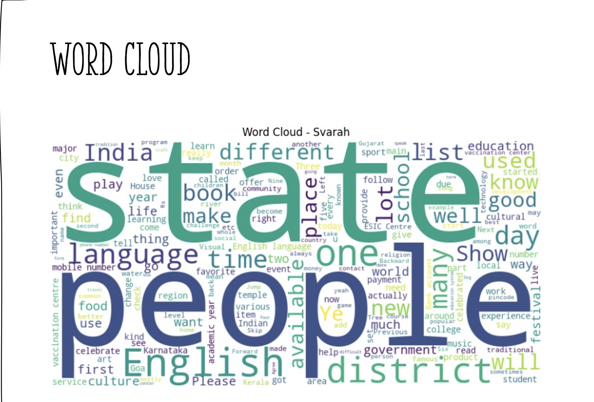
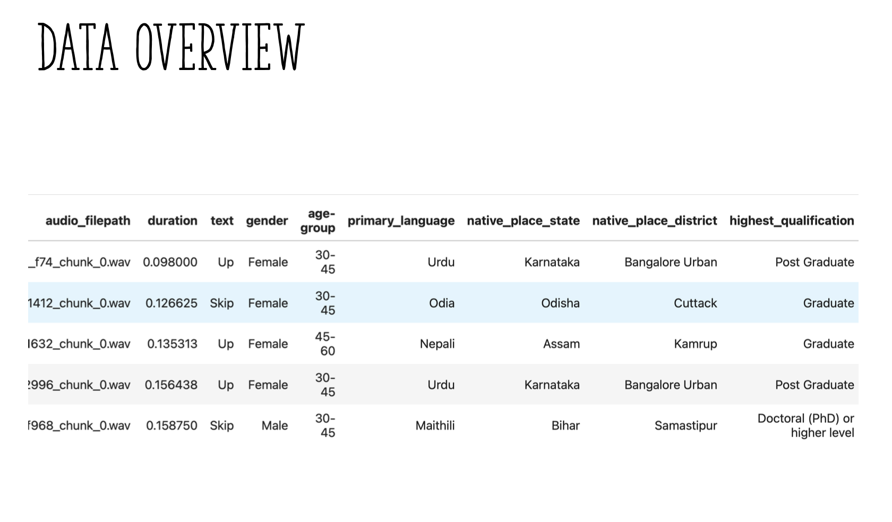
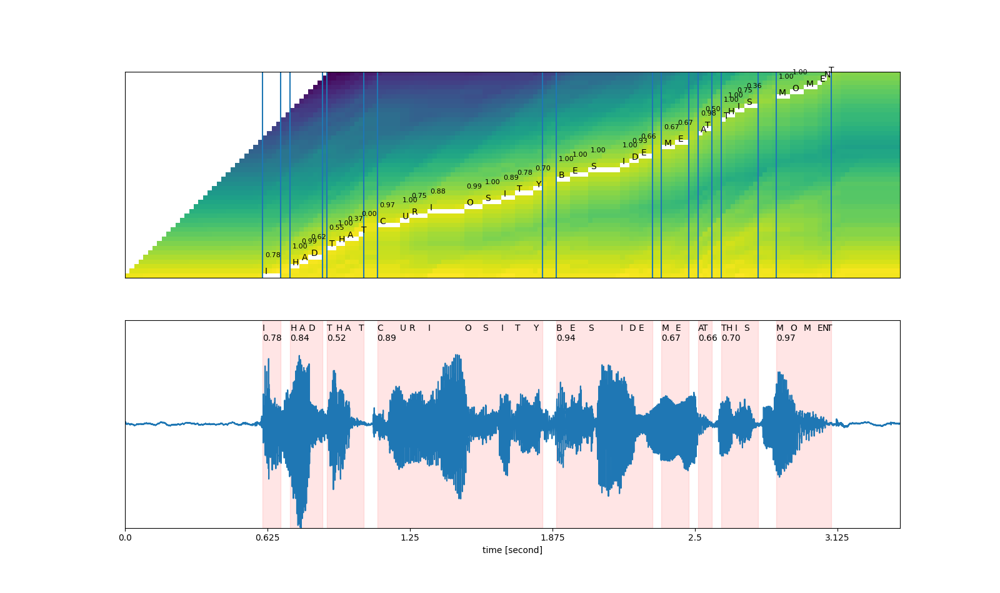
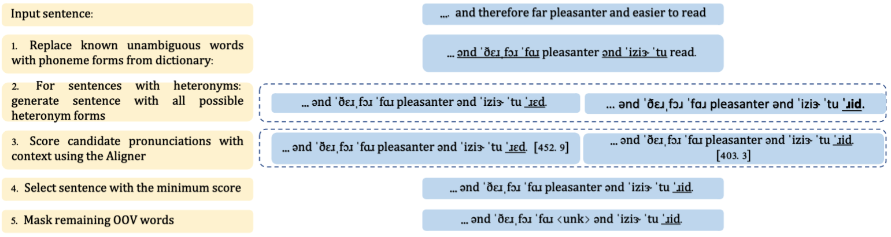
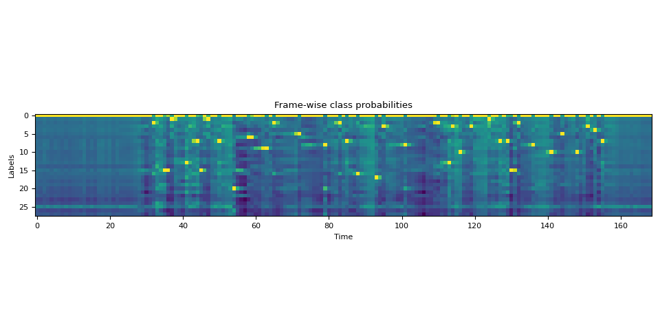

    # Making Sense of Indian-Accented English: A Journey to Better Speech Recognition

## Introduction
Speech technologies like voice assistants, transcription tools, and captioning services rely on Automatic Speech Recognition (ASR) to turn spoken words into written text. ASR has improved dramatically in recent years, but many systems still struggle when people speak with different accents. Think about the vast linguistic diversity found in India: English is commonly spoken, but influenced by dozens of regional languages, leading to unique pronunciations, rhythms, and words not found in standard Englis...

This blog presents a project carried out as part of a graduate-level study at the University of Florida, under Dr. Grant’s mentorship. The goal was to enhance ASR performance for Indian-accented English—making the technology more inclusive and accurate. The journey started with traditional alignment methods and evolved to cutting-edge techniques, integrating special models that handle unfamiliar words and subtle accent differences. By the end, the hope is to show that advanced methods can bring ASR closer...
    


---

## What is ASR, and Why Are Accents Challenging?
Automatic Speech Recognition (ASR) is the technology that converts audio of spoken language into written text. Common examples include the voice assistant on your phone or automatic subtitles on videos. While ASR works well for “standard” English (like American or British accents), it can get confused by accents that differ in pronunciation patterns or vocabulary.

### Why Indian-Accented English?
Indian English often incorporates phonetic elements from native languages. Some sounds may be pronounced with a curled tongue (retroflex), certain vowel sounds might be shortened or lengthened differently, and local brand names or loanwords appear frequently. These variations can trip up ASR systems trained on more “standard” English.


    


---

## The Svarah Dataset: A Starting Point
The project used a dataset called Svarah, containing about 9.6 hours of Indian-accented English speech from 117 speakers across 19 states. Each audio clip has a transcript and metadata like the speaker’s native language.

**Example: A Data Entry**

```
{
  "audio_filepath": "audio_files/speaker_03_clip_05.wav",
  "duration": 4.5,
  "text": "I would like to pay using Paytm",
  "gender": "male",
  "primary_language": "Hindi"
}
```




This dataset exposed how certain words—like “Paytm”—don’t exist in standard dictionaries, and how pronunciation patterns differ from what most ASR models expect.
    


---

## First Attempts: Forced Alignment with MFA
The initial step was using the Montreal Forced Aligner (MFA). Forced alignment tries to match every word in the transcript to a specific time in the audio.

### How MFA Works:
1. Take an audio file and its transcript.
2. Use a pronunciation dictionary and a standard acoustic model.
3. Align words and phonemes with time segments in the audio.



**Challenge:** Standard dictionaries and models couldn’t handle OOV (out-of-vocabulary) words like “Paytm” or accented pronunciations.

**Sample MFA Output:**

| Word  | Start Time | End Time |
|-------|------------|----------|
| I     | 0.00       | 0.20     |
| would | 0.20       | 0.50     |
| like  | (alignment failed) |


These misalignments signaled the need for a more dynamic approach.

---

## Introducing G2P Models: Handling Unfamiliar Words
Grapheme-to-Phoneme (G2P) models predict how to pronounce a new word. When MFA sees “Paytm” and panics, G2P steps in to generate its phonemes.

**Example Code:**

```python
g2p_model = load_g2p_model("g2p_pretrained.pt")
word = "paytm"
phonemes = g2p_model.predict(word)
print("Phonemes for {}: {}".format(word, phonemes))
```

**Possible Output:**

```
Phonemes for paytm: p eɪ t ə m
```

Now the ASR system knows how “Paytm” might sound.


---

## Adapting Acoustic Models to Accents
Acoustic models learn to convert audio signals into phonemes or words. A model trained on American English might not understand Indian English rhythms and sounds. Fine-tuning the acoustic model with Indian-accented data teaches it to recognize new sound patterns.

**Code Snippet:**

```python
acoustic_model = load_pretrained_model("asr_base.pt")
acoustic_model.finetune("svarah_data/", epochs=5)
```


With G2P handling new words and the acoustic model familiarized with the accent, alignment and transcription both improve.



---

## CTC Segmentation: More Flexible Alignment
Connectionist Temporal Classification (CTC) segmentation allows the model to figure out alignments without depending heavily on a fixed dictionary. It predicts phonemes frame-by-frame and finds the best fit.




**Code Snippet:**

```python
ctc_aligner = CTCAligner(acoustic_model)
alignment = ctc_aligner.align("audio_files/speaker_03_clip_05.wav", "I would like to pay using Paytm")
print(alignment)
```

**Possible Output:**

| Word  | Start Time | End Time |
|-------|------------|----------|
| I     | 0.00       | 0.15     |
| would | 0.15       | 0.35     |
| like  | 0.35       | 0.55     |
| to    | 0.55       | 0.70     |
| pay   | 0.70       | 0.90     |
| using | 0.90       | 1.20     |
| Paytm | 1.20       | 1.50     |


CTC segmentation is more adaptive, making it well-suited to accented data.


---

## Stepping Up the Game: Advanced Models with NeMo and Conformer
As the project evolved, it integrated NVIDIA’s NeMo toolkit, which simplifies working with advanced ASR models. One state-of-the-art architecture is the Conformer, combining convolution and attention mechanisms for superior accuracy.

### Why Conformer Models?
- They handle long audio and tricky accents better.
- With enough training and adaptation, they produce highly accurate transcriptions.

**Example Code:**

```python
import nemo.collections.asr as nemo_asr

asr_model = nemo_asr.models.ASRModel.from_pretrained("nvidia/stt_en_conformer_ctc_large")
transcript = asr_model.transcribe(["audio_files/speaker_03_clip_05.wav"])
print("Transcribed:", transcript)
```

**Possible Output:**

```
Transcribed: ['I would like to pay using paytm']
```


---

## Putting It All Together
1. **Start with Data (Svarah):** Understand the unique challenges in Indian-accented speech.
2. **Forced Alignment (MFA):** Initial try, but it struggled with OOV words and accents.
3. **G2P Models:** Automatically guess pronunciations for new words.
4. **Acoustic Model Fine-Tuning:** Teach the model to “hear” the accent’s unique sounds.
5. **CTC Segmentation:** Get more flexible, accurate alignments.
6. **Conformer Models via NeMo:** Leverage cutting-edge architecture for top-tier accuracy.


---

## Why Does This Matter?
When ASR understands accented speech better, more people can use voice technology in their daily lives. Imagine an educational video for a multilingual classroom, or a banking service accessible via voice commands. Ensuring everyone’s voice is understood fairly is a critical step towards technological inclusivity.

---

## Future Directions
- **Multi-Accent Support:** Adapt similar methods to other accents and languages.
- **Real-Time Streaming:** Make systems that improve as they listen.
- **Enhanced Language Modeling:** Add context-aware models to predict words based on conversation topics.

---

## Conclusion
This journey—from relying on rigid dictionaries to using G2P models, adapting acoustic features, employing CTC segmentation, and finally leveraging advanced Conformer models—shows that ASR can be tuned to better handle Indian-accented English. Under Dr. Grant’s mentorship, these techniques have brought the project closer to an ASR system that truly listens to everyone.

---

## References & Further Reading:
- Pandey, P. (2016). Indian English Prosody.
- Sailaja, P. (2009). Indian English. Edinburgh University Press.
- Gargesh, R. (2004). Indian English: Phonology.
- NVIDIA NeMo Toolkit: NVIDIA NGC Catalog - NeMo ASR
- NVIDIA Canary Model: NVIDIA/NeMo GitHub Repo


